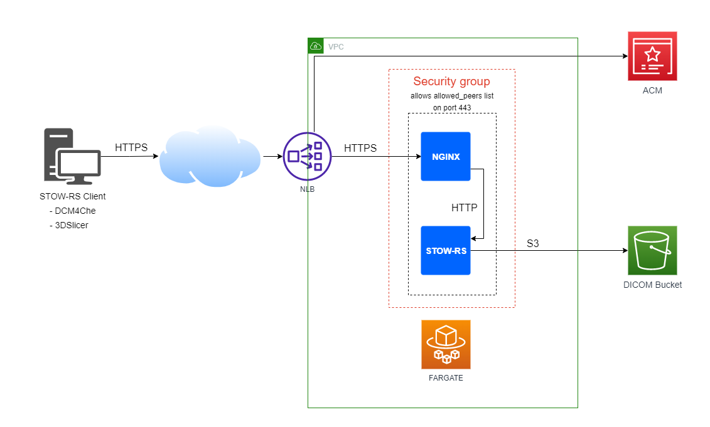
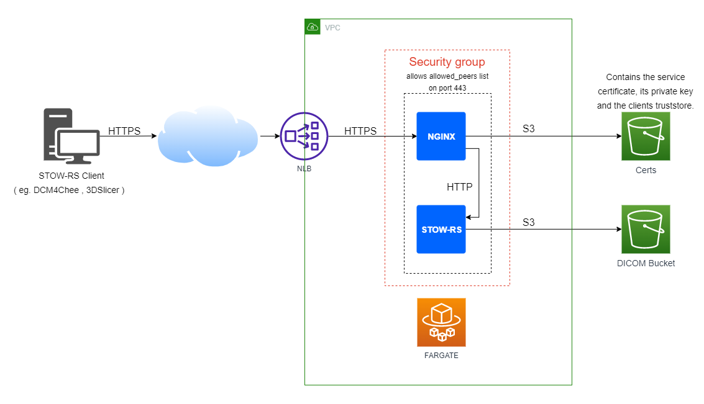
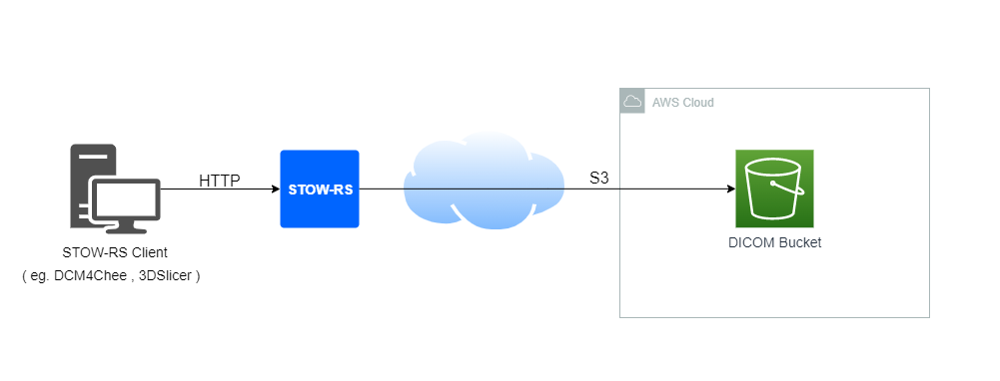
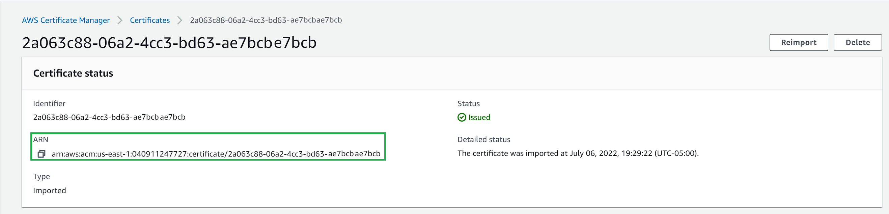
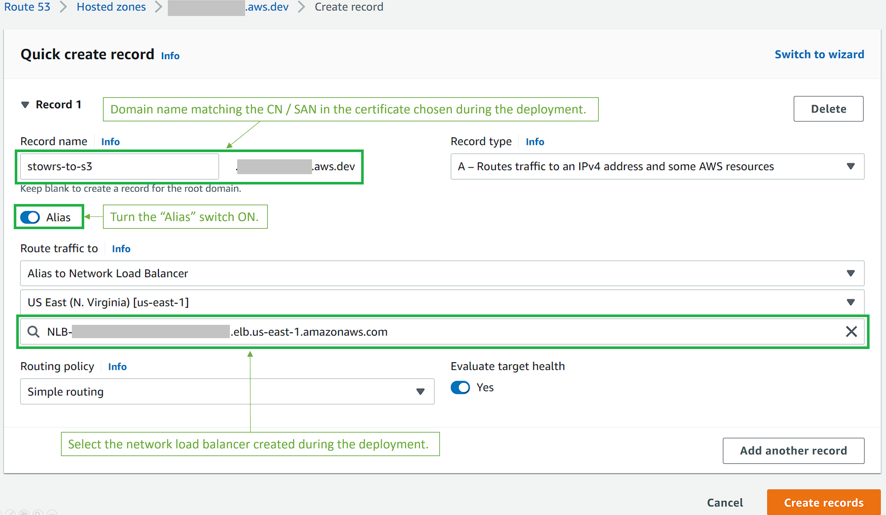

# STOWRS-to-S3

This project is a Python based STOW-RS to S3 Service. This service receives DICOM PS18 compliant STOW-RS requests to store, and copies the data to a specified S3 bucket over parallel threads. This project can be deployed either in the AWS Cloud or on-premises. The project comes with an AWS CDK infrastructure as code package allowing to deploy it to the AWS Cloud easily, and can also be executed as a normal python process or as an OCI container ( eg. docker image ) if deployed on-premises. 

## Prerequisites for running STOWRS-to-S3 in AWS

You will need the following software packages installed locally to deploy this solution in AWS Cloud.

* <b>Python3/pip:</b><BR>The deployment automation code is written in Python.
  
* <b>CDK:</b><BR>Please refer to [CDK](https://docs.aws.amazon.com/cdk/v2/guide/work-with-cdk-python.html) documentation to install the framework and bootstrap your AWS environment. 

* <b>Docker:</b><BR>When running the CDK deploy command, the container images will automatically be built (via docker build command), and sent to AWS ECR registry. Docker must be present on the machine where the cdk deployment is executed. Docker desktop is sufficient. Refer to [Docker Desktop](https://docs.docker.com/desktop/install/mac-install/) documentation to install it on your machine.

* <b>Domain name and Certificate (recommended):</b><BR>The STOWRS-to-S3 web service is exposed via HTTPS. Because most STOW-RS clients will verify that the certificate exposed by the web service is valid, it is recommended to have a valid FQDN and certificate to associate to the service. Domain name, related FQDN and certificates can be created vi AWS Route53 and AWS ACM. The service also supports the usage of a private certificate or certificates issued by other authority than ACM ( eg. Let's Encrypt Certbot ) . Alternatively the service can also be configured to fetch any kind of certificate from S3.

<b>Note:</b> 08/03/2022 - Docker Desktop 4.11.0 has an issue preventing the integration with CDK. Until that is resolved, the use of Docker Desktop 4.10.0 is recommended.


## Project content
The project is composed of 3 folders:

  * app: contains the STOWRS-to-S3 application. The file main.py is the python3 application itself. The folder also contains the Dockerfile used to generate the app container.
  
  * nginx: Contains the certificate configuration script and the Dockerfile used to generate the image.
  
  * cdk: Contains the automation code used to deploy this project in AWS Cloud.
  
  * dcm-samples: Contains 3 anonymized DICOM files used to test that the web service works as intended.
  
  * img: contains the PNG images displayed in this documentation.
  
## Deployment Design in AWS

STOWRS-to-S3 can be deployed with 2 slightly different designs, depending on the client authentication type selected. With the the Anonymous client mode, the TLS connection is terminated at the elastic load balancer level. With the ClientAuth mode, the TLS connection is terminated at the nginx container level. The ClientAuth mode allows the verification of the client requesting the STOW transcation by requesting a client certificate.


### Deployment allowing anonymous access

 

With this deployment option the TLS communication initiated by the client is terminated at the elastic load balancer level. The network load balancer then initiates a new TLS communication with the nginx conainer, ensuring that the data remains encrypted end-to-end. The stors-to-s3 web service certificate is fetched from ACM directly. This certificate can be either public or private. 

<b>Note:</b> Regardless of whether the request is authenticated or anonymous, remember that for a server certificate to be found valid by the STOW-RS clients, the FQDN (HTTP HOST) used to communicate with the webservice must match the SAN ( or CN ) attributes of the server certificate. Some STOW-RS clients allow bypassing of the server certificate verification to facilitate integration tests. (eg. dcm4chee STOWRS client)

### Deployment allowing for Client authentication via ClientAuth method (mTLS)
   

With this deployment option the stowrs-to-s3 web service certificate is fetched from the S3 cert bucket, and configured to be used in nginx at container startup. In this mode nginx is also configured to request the client certificate via TLS ClientAuth method. The client certificate is verified against the content of the file truststore.crt, also fetched during the nginx container startup.


### Deployment Design On-premise



This deployment option is a very straight forward way to export DICOM data into an S3 bucket securely, as long as compute exists on-premises to run the STOW-RS container or its python3 process directly. In this mode the communication between the STOWRS client and the service is unencrypted, but the communication between the STOWRS service and S3 remain secured. In this deployment model it is the responsability of the user to ensure that the S3 bucket is configured accordingly to the user's own requirements or regulation. For instance, HIPAA regulation requires S3 buckets used to store medical data to be encrypted. When deployed on-prem the STOW-RS container / application reads the AWS credentials either from environment variables, or from awscli configuration file if the aws client is installed on the same environment.

# Installation

By default the project files come configured to be deployed in Anonymous mode with ACM. This mode should allow most users to get started easily. To go on with this installation mode refer to the section [Installing via CDK for anonymous mode with ACM](#Installing-via-CDK-for-anonymous-mode-with-ACM).

## Installing via CDK for anonymous mode with ACM

This section describes the steps to deploy the stowrs-to-s3 service and expose its web service via HTTPS with a certificate managed by AWS ACM. The service does not verify the cient certificate. Access to the service can be limited to a list of allowed IP addresses which can be configured in `stowrs-to-s3/cdk/config.py`.

### Requirements:
* A fully qualified domain name (FQDN) to associate with the web service URL. Public domains can be registered via AWS [Route 53](https://docs.aws.amazon.com/Route53/latest/DeveloperGuide/domain-register-update.html) or any other other domain provider ( Eg. Google domains ).
* A verified certificate must be present in ACM, either public or private. Refer to AWS ACM documentation [to issue a public certificate](https://docs.aws.amazon.com/acm/latest/userguide/gs-acm-request-public.html) or [import a private certificate](https://docs.aws.amazon.com/acm/latest/userguide/import-certificate.html) in ACM.

### Steps

1. Clone this repository or copy its contents to your local file system. 
2. In `stowrs-to-s3/cdk`, edit the following lines of the file `config.py`:
    ```json
    "certificate_auth_mode" : "anonmyous",  
    "certificate_mode" : "ACM",
    "certificate_arn" : "Enter the cerificate ARN as found in the AWS console ACM menu. See example below",
    ```
       
3. Update the list of allowed IP addresses as needed. By default the CIDR 0.0.0.0/0 is present in the list, which gives access to all public IP addresses. You may want to remove this entry and replace/add your own public IP addresses to restrict the access to the stowrs-to-s3 service. The below example shows how to configure the service to allow access only to the IP adddresses 34.54.67.89 and 98.76.54.32. 
   ```json
    "peer_list" : {
        "34.45.67.89/32",
        "98.76.54.32/32"
    }
   ```
4. Save the changes to the file `stowrs-to-s3/cdk/config.py`. 
5. Still located in the directoy `stowrs-tos3/cdk`, execute the following command:
   ```console
   cdk deploy
   ```
6. The command will output the list of AWS resources to be created. Confirm the creation of the resources, and wait for CDK to deploy the web service. The initial deployment takes about 10 minutes. 
7. Create a new CNAME entry in your DNS management system to associate the network load balancer FQDN with the domain names corresponding to the selected certificate. The network load balancer FQDN can be found in the AWS console EC2 menu->Load balancers section. The name of the load balancer created by CDK for this project is prefixed by `stowr-nlb`. If your domain is registered via AWS Route 53 you can create an alias to link the domain name corresponding to the selected certificate to the network load balancer.
   
8. Wait for the DNS record to propagate. You can periodically test the propagation progress by executing an nslookup command, and check if the returned FQDN is the one for the network load balancer:
   ```console
      # nslookup stowrstos3.XXXXXXXXXX.us
      Server:         172.27.32.1
      Address:        172.27.32.1#53

      Non-authoritative answer:
      stowrstos3.XXXXXXXXXX.us        canonical name = stowr-nlb-XXXXXXXXXXXX.elb.us-east-1.amazonaws.com.
      Name:   stowr-nlb-XXXXXXXXXXXX.elb.us-east-1.amazonaws.com
      Address: XXX.XXX.XXX.XXX
   ```
9.  At this point the web service is up & running. Refer to the [testing](#testing) section to test that the webservice performs as intended.
   
## Installing via CDK for clientAuth mode with certificates from S3.

This section describes the steps to deploy the the STOW-RS service and expose its web service via HTTPS with a certificate fetched from an S3 bucket. In this mode the service does verify the client certificate against the content of the file truststore.crt also fetched fom the same bucket. The access to the service is also restricted to the list of IP addresses allowed in the configuration file (`stowrs-to-s3/cdk/config.py`).

### Requirements:
* A public or private certificate in 2 separate PEM format files. The full chain certificate should be called `certificate.crt` and the certificate private key should be called `certificate.key`.
* If the certifcate is public, the fully qualified domain name (FQDN) to associate with the web service URL should match the CN / SAN in the provided certificate.

### Steps:

1. Clone this repository or copy its contents to your local file system. 
2. In `stowrs-to-s3/cdk` edit the following lines of the file `config.py:
    ```json
    "certificate_auth_mode" : "clientauth",  
    "certificate_mode" : "FROMS3",
    "certificate_arn" : "",
    "certificate_bucket" : "stowrstos3-certs", 
    ```
3. Update the list of allowed IP addresses as needed. By default the CIDR 0.0.0.0/0 is present in the list, which gives access to all public IP addresses. You may want to remove this entry and replace/add your own public IP addresses to restrict the access to the stowrs-to-s3 service. The below example shows how to configure the service to allow access only to the IP adddresses 34.54.67.89 and 98.76.54.32
   ```json
    "peer_list" : {
        "34.45.67.89/32",
        "98.76.54.32/32"
    }
   ```
4. Save the changes to the file `stowrs-to-s3/cdk/config.py`. 
5. Still located in the directoy `stowrs-tos3/cdk`, execute the following command:
   ```console
   cdk deploy
   ```
6. The command will output the list of AWS resources to be created. Confirm the creation of the resources, and wait for CDK to deploy the web service. The initial deployment takes about 10 minutes. 
7. Once created the web service is up & running but exposes its own self-signed certificate. To replace the certificate with your own : 
   1. Copy the following files in the `stowrstos3-certs` S3 bucket (CDK adds a random string after the bucket name prefix). The files can be copied to the bucket by drag-and-drop in the AWS console S3 menu, after selecting the S3 bucket. 3 files are required, the names are case-sensitive:
      1. <b>certificate.crt</b> : Contains the full-chain of the certificate exposed by the nginx service.
      2. <b>certificate.key</b> : Contains the private key of the certificate exposed by the nginx service.
      3. <b>truststore.crt</b> : Contains the public keys of the client cetificates authorized to connect the stowrs-to-s3 service.
   2. Restart the ECS Fargate service for the the container to fetch the certificate files from the S3 bucket:
      1. Open the ECS menu in the AWS console.
      2. Click on the ECS cluster named stowrs-to-s3-FargateService.
      3. In the service tab, click on the service named stowrs-to-s3-Fargateservice.
      4. In the service menu, click on the Task menu and click on the task name.
      5. In task menu click on the stop button on the top-right corner.
8. Wait for the task to be spawned again, after 5 minutes the web service should be available again. You can verifiy that the certificate was properly loaded but opening the the url `https://[your service FQDN]/studies` and checking the certificate exposed. <b>Note:</b> when browsing to this URL you should receive an `"400 Bad Request. No required SSL certificate was sent"`, which is a normal response as the browser do not provide a client certificate.


## Solution configuration
Before the deployment of this solution the user can edit the file `/cdk/config.py` to configure it as needed. The table below provides information about key parameters to change to achieve more advanced configurations. 


| Parameter Name          | Type        | Possible value                                                              | Description                                                                                                         |
| ----------------------  | ----------- | --------------------------------------------------------------------------- | -------------------------------------------------------------------------------------------------------------------                                              
| CDK_APP_NAME            | string      | Lower case alphanumerical characters and "-". Equal or less than 20 chars.  | This parameter is used as a prefix in the name for all the resources created by this CDK code.                      |
| VPC_CIDR                | string      | This string should match to proper CIDR convention.                         | The selected CIDR should be one compatible with range authorized by AWS. Refer to AWS VPC Sizing in IPV4 section of the [AWS VPC documentation](https://docs.aws.amazon.com/vpc/latest/userguide/configure-your-vpc.html#vpc-sizing-ipv4) |                                                                                                                     |
| DICOM_BUCKET            | string      | Lower case alphanumerical charcaters, "." and "-".                          | The prefix for the name of the S3 bucket used to store the DICOM data received.  
| CERTIFICATE             | JSON dict   | See below for the parameters of the dictionary. | |
| CERTIFICATE>certificate_auth_mode | string | Can be set to "anonymous" or "clientauth". default to anonymous | This setting defines if nginx requests the client to provide a certificate for authentication purposes. |
| CERTIFICATE>certificate_mode | string | Can be set to "ACM" or "FROMS3". default to "ACM" | If selecting ACM, the certificate needs to be created or imported in ACM first, and the certificate ARN must be added in the parameter certificate_arn below. Note the service does not support clientauth when the mode is set to ACM. |
| CERTIFICATE>certificate_arn | string | Amazon Resource Name of the certificate in AWS ACM. | Only required when the certificate mode is set to 'ACM'. Ignored when `certificate_mode` is set to `FROMS3` |
| CERTIFICATE>certificate_bucket | string | Lower case alphanumerical charcaters, "." and "-". | The prefix for the name of the S3 bucket used to store the DICOM data received. Only required when the certificate mode is set to 'FROMS3'. Ignored when `certificate_mode` is set to `ACM` |
| ALLOWED_PEERS>peer_list           | JSON dict   | An array of strings representing the CIDR of allowed clients IP addresses.           | The default value is 0.0.0.0/0 , which allows all IP addresses to access the service.                               |
| FARGATE_TASK_DEF        | JSON dict   | See below for the parameters of the dictionary.                                                                             |                                                                                                                     |
| FARGATE_TASK_DEF>memory | integer     | 6144 is recommended to allow acquisition of large DICOM objects. Can be increased if needed | The amount of memory assigned to the service Task. This is the total memory for the nginx and the app containers combined. |
| FARGATE_TASK_DEF>cpu    | integer     | 2048 is recommended. Assume 1 core * 1024 to calculate this value. | The CPU unit number is related to the memory amount. Refer to the Task CPU and memory section of the [AWS ECS Fargate documentation](https://docs.aws.amazon.com/AmazonECS/latest/developerguide/AWS_Fargate.html) for compatible combinations of RAM and CPU values | 
| FARGATE_TASK_DEF>task_count    | integer  | 1 by default, 2 for or more for high-availability, more for scaling. |  | 
| FARGATE_TASK_DEF>nginx_container    | JSON dict | See below for the parameters of the dictionary related to the nginx container.  |  | 
| FARGATE_TASK_DEF>nginx_container>source_directory    | string | default to `../nginx`  | Relative path to the folder containing the files necessary to build the container. | 
| FARGATE_TASK_DEF>nginx_container>memory    | integer | default to 2048  | This value is unused at the moment.. Only global CPU and RAM at the task level is relevant. | 
| FARGATE_TASK_DEF>nginx_container>cpu    | integer | default to 1024  | TThis value is unused at the moment. Only global CPU and RAM at the task level is relevant.  |
| FARGATE_TASK_DEF>app_container    | JSON dict | See below for the parameters of the dictionary related to the stowrs-to-s3 container.  |  | 
| FARGATE_TASK_DEF>app_container>source_directory    | string | default to `../app`  | Relative path to the folder containing the files necessary to build the container. | 
| FARGATE_TASK_DEF>app_container>memory    | integer | default to 2048  | This value is unused at the moment. Only global CPU and RAM at the task level is relevant. | 
| FARGATE_TASK_DEF>app_container>cpu    | integer | default to 1024  | This value is unused at the moment. Only global CPU and RAM at the task level is relevant.  |
| FARGATE_TASK_DEF>app_container>envs    | JSON dict | See below for the parameters of the dictionary related to env variables of the stowrs-to-s3 app.  |   |
| FARGATE_TASK_DEF>app_container>envs>PREFIX    | string | alphanumeircal characters,  "-" , "_" and ".". If left empty, the DICOM files are stored at the root of the S3 bucket.  | This env variable corresponds to the location prefix on the DICOM S3 bucket. Eg: With a S3 bucket named  "dicom-bucket" and an env variable PREFIX set to "instance1", the DICOM files received would be saved to s3://dicom-bucket/instance1/[studyInstanceUID]/[SeriesInstanceUID]/[SOPInstanceUID]  |
| FARGATE_TASK_DEF>app_container>envs>WADOURL    | string | alphanumeircal characters,  "-", ":" , "/" and ".". If left empty the service does not return WADO URLs in the STOWRS response.  | This env variable corresponds to the WADO URL where stored DICOM instances could be requested from. The service automatically appends the part of the URL referencing the study / series / Instance to this 1st part of the WADO URL in the STOWRS response.  |
| FARGATE_TASK_DEF>app_container>envs>LOGLEVEL    | string | "ERROR" , "INFO" , "WARNING" , "DEBUG" or "CRITICAL". default to WARNING   | Set the log level of the stowrs-to-s3 app. Logs are available in CloudWatch log group.  |
| FARGATE_TASK_DEF>app_container>envs>RESPONSEDELAY    | string | default to "0".    | Set a time delay before the STOWRS response is returned to the client. |
| RESOURCE_TAGS> tag_list         | JSON dict   | A list of key : value pairs | This list can be used to add any resouce tag useful to the user. <br><b>Note:</b> A tag called `deployment` will be automatically added to all resources created in this solution. The `deployment` tag is populated with the the value of the parameter `CDK_APP_NAME`.  |


## Testing
This section covers the steps to test that the stowrs-to-s3 web service has been successfully deployed and is ready to be used. The test steps provided below can only be used when the service is configured with the anonymous mode.

### Steps

1. Download and unzip the [dcm4che utilities](https://sourceforge.net/projects/dcm4che/files/dcm4che3/).
2. In the `dcm4che-[version]/bin` folder, execute the following command:
  ```console
      For windows:
      stowrs.bat -a json --limit 3 --url https://[web service FQDN]/studies [location of the stowrs-to-s3 folder]\dcm-samples
  ```

  ```console
      For Linux:
      ./stowrs -a json --limit 3 --url https://[web service FQDN]/studies [location of the stowrs-to-s3 folder]/stowrs-to-s3/dcm-samples/
  ```

If succeeded the service repsonse should look like this:
```console
  Scanning files to send
Directory /home/jpleger/Code/stowrs-to-s3/dcm-samples/ contains 3 paths.
..
Scanned 3 files in 0.028s (=9ms/file)
..
Connected to https://stowrstos3.awsjpleger.us/studies in 131ms
14:55:14.135 INFO  - > POST https://stowrstos3.awsjpleger.us/studies
14:55:14.138 INFO  - > Accept : application/dicom+json
14:55:14.138 INFO  - > Content-Type : multipart/related; type="application/dicom"; boundary=myboundary
14:55:14.886 INFO  - < HTTP/1.1 Response: 200 OK
14:55:14.886 INFO  - < Server : nginx/1.22.0
14:55:14.887 INFO  - < Connection : keep-alive
14:55:14.887 INFO  - < Content-Length : 1676
14:55:14.887 INFO  - < Date : Mon, 01 Aug 2022 19:55:14 GMT
14:55:14.887 INFO  - < Content-Type : application/json
14:55:14.887 INFO  - < Response Content: 
14:55:14.888 DEBUG - {"00081190": {"Value": ["https://[WADOURL]/dicomweb/studies/1.3.6.1.4.1.14519.5.2.1.2692.1975.673079780724926389963058818628"], "vr": "UR"}, "00081198": {"Value": [], "vr": "SQ"}, "00081199": {"Value": [{"00081150": {"Value": ["1.2.840.10008.5.1.4.1.1.2"], "vr": "UI"}, "00081155": {"Value": ["1.3.6.1.4.1.14519.5.2.1.2692.1975.202691873465793515864363478235"], "vr": "UI"}, "00081190": {"Value": ["https://[WADOURL]/dicomweb/studies/1.3.6.1.4.1.14519.5.2.1.2692.1975.673079780724926389963058818628/series/1.3.6.1.4.1.14519.5.2.1.2692.1975.219841223840616301810162211436/instances/1.3.6.1.4.1.14519.5.2.1.2692.1975.202691873465793515864363478235"], "vr": "UR"}}, {"00081150": {"Value": ["1.2.840.10008.5.1.4.1.1.2"], "vr": "UI"}, "00081155": {"Value": ["1.3.6.1.4.1.14519.5.2.1.2692.1975.213159715579379981169498621170"], "vr": "UI"}, "00081190": {"Value": ["https://[WADOURL]/dicomweb/studies/1.3.6.1.4.1.14519.5.2.1.2692.1975.673079780724926389963058818628/series/1.3.6.1.4.1.14519.5.2.1.2692.1975.219841223840616301810162211436/instances/1.3.6.1.4.1.14519.5.2.1.2692.1975.213159715579379981169498621170"], "vr": "UR"}}, {"00081150": {"Value": ["1.2.840.10008.5.1.4.1.1.2"], "vr": "UI"}, "00081155": {"Value": ["1.3.6.1.4.1.14519.5.2.1.2692.1975.272935674749940779060447240348"], "vr": "UI"}, "00081190": {"Value": ["https://[WADOURL]/dicomweb/studies/1.3.6.1.4.1.14519.5.2.1.2692.1975.673079780724926389963058818628/series/1.3.6.1.4.1.14519.5.2.1.2692.1975.219841223840616301810162211436/instances/1.3.6.1.4.1.14519.5.2.1.2692.1975.272935674749940779060447240348"], "vr": "UR"}}], "vr": "SQ"}}
Sent 3 objects (=0.723MB) in 0.756s (=0.957MB/s) in this http request
Sent overall 3 objects (=0.723MB) in 0.887s (=0.816MB/s) in one TCP connection
```

<b>Note:</b> Run the command `stowrs.bat --help` or `./stowrs --help` to review the options of this utility, in particular the ones related to certificate verification in case the web service is configured to use a private certificate. 

    